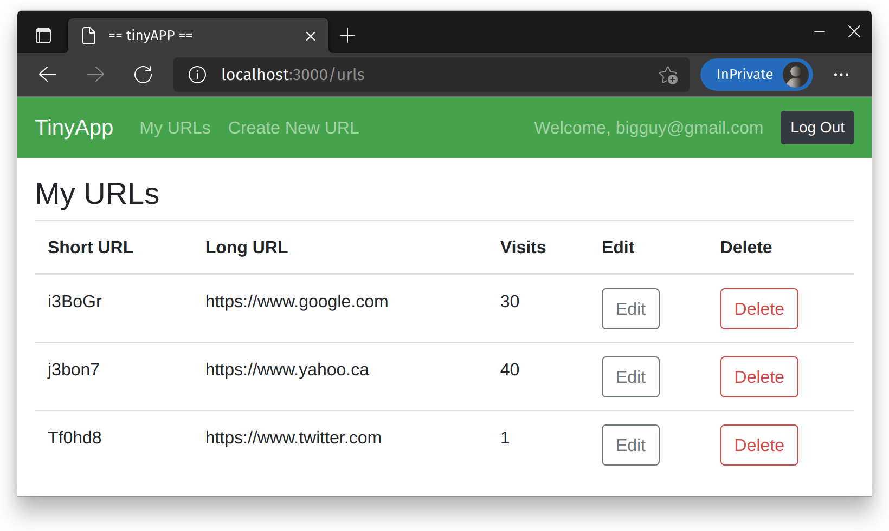
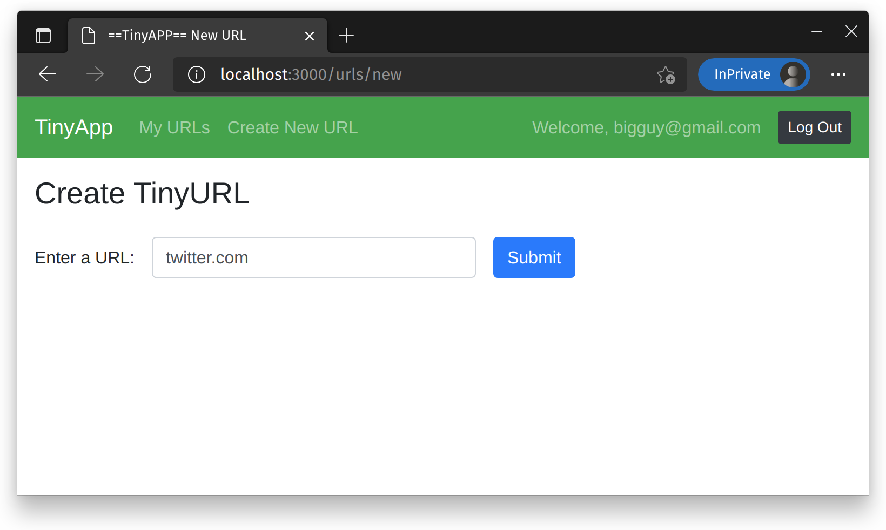

# tinyAPP Project

TinyApp is a full stack web application built with Node and Express that allows users to shorten long URLs (à la bit.ly).
It allows users to store links and see how many times they've been followed. Links can be redirected to new URLs and deleted.

## Final Product

## Dependencies

- Node.js
- Express
- EJS
- bcrypt
- body-parser
- cookie-session

## Getting Started

- Install all dependencies (using the `npm install` command).
- Run the development web server using the `npm start` command.
- Open your web browser to `localhost:3000/`